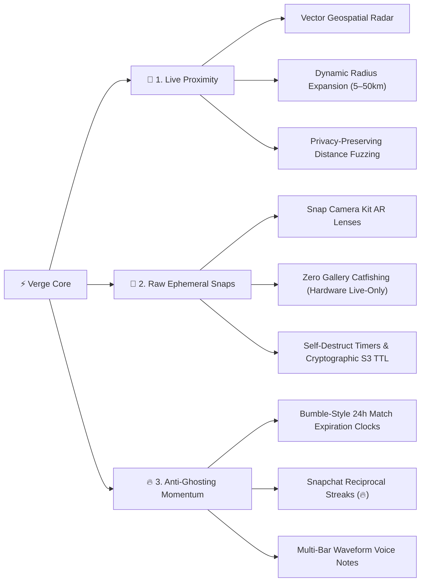

# ⚡ Verge

> **Dating on the verge of the real moment.**  
> A next-generation social dating platform combining **real-time proximity discovery**, **raw ephemeral camera snaps**, and **anti-ghosting conversation momentum**.

---

[](LICENSE)
[](https://flutter.dev)
[](https://kotlinlang.org)
[](https://nestjs.com)
[](https://www.postgresql.org)
[](https://camerakit.snap.com)
[](https://www.prisma.io)

---

## 🌟 Vision & The 3 Core Pillars

Modern dating apps suffer from profile fatigue, catfishing with years-old photos, and "match graveyards" where conversations dissolve before they even start. **Verge** solves this with three core product pillars:



### 1. 📍 Live Proximity & Geospatial Radar
* **Concentric Distance Rings**: Real-time vector radar displaying active profiles within calibrated proximity zones (`5 km`, `10 km`, `15 km`, `25 km`).
* **Deck Depletion Radius Expansion**: When discovery cards run out, users can dynamically expand their radius (`25 km → 50 km`) with an interactive slider to unlock more local singles.
* **Privacy-First Location**: Exact GPS coordinates are never transmitted or exposed to peers. Distances are computed server-side via PostGIS and fuzzed for safety.

### 2. 📸 Raw Ephemeral Snaps (Zero Catfishing)
* **Live-Only Capture**: Eliminates deceptive pre-saved camera-roll uploads. Photos and videos must be captured live through the camera lens.
* **Snap Camera Kit 1.12.0 Integration**: Native hardware camera access with official Snapchat AR lenses, face-tracking, and beauty filters.
* **Self-Destructing Media**: Senders set view limits (`1s` to `30s`). Snaps are served via short-lived signed URLs (45-second validity) and automatically purged from cloud storage immediately after viewing or expiration.
* **Snooping Protection**: Native client-side screenshot and screen recording detection alerts peers in real-time.

### 3. 🔥 Anti-Ghosting Reciprocal Momentum
* **Bumble-Style 24-Hour Expiration Rings**: New matches are queued with dynamic progress countdown rings (`⏳ 18h`, `⏳ 2h`). If neither party initiates a conversation within 24 hours, the match dissolves permanently.
* **Snapchat-Style Daily Streaks (`🔥`)**: Mutual daily exchanges maintain streak counters (`🔥 14`). When a streak is about to lapse, urgent countdown warnings (`🔥 8 · ⏳ 3h`) incentivize staying engaged.
* **Interactive Waveform Voice Notes**: Ultra-low latency voice snippets with rich animated audio waveforms for authentic vocal connection.

---

## 🏗️ System Architecture

```
                           ┌────────────────────────────────────────┐
                           │              Verge Clients             │
                           │  • Flutter (iOS & Android)             │
                           │  • Jetpack Compose (Native Android)    │
                           │  • Snap Camera Kit 1.12.0 AR Lenses    │
                           └──────────────────┬─────────────────────┘
                                              │
                         HTTPS (REST)         │   WSS (Socket.IO)
                         Auth / Profiles      │   Chat / Snaps / Streaks
                                              ▼
                           ┌────────────────────────────────────────┐
                           │          Verge API Gateway             │
                           │              (NestJS 10)               │
                           │  • JwtAuthGuard + Google Credentials   │
                           │  • Global Prisma Exception Filter      │
                           │  • Throttling & Rate-Limiting Pipes    │
                           │  • UUID Validation & Bounds Checking   │
                           └───────┬──────────────┬───────────────┬─┘
                                   │              │               │
                                   ▼              ▼               ▼
                       ┌────────────────┐ ┌───────────────┐ ┌─────────────┐
                       │  PostgreSQL 16 │ │ Redis Engine  │ │  S3 Storage │
                       │    + PostGIS   │ │ • Pub/Sub     │ │  • MinIO/S3 │
                       │  • Geospatial  │ │ • Rate Limits │ │  • Signed   │
                       │  • Prisma ORM  │ │ • Socket Room │ │    Presigns │
                       │  • Strict 18+  │ │   State       │ │  • Auto-TTL │
                       └────────────────┘ └───────────────┘ └─────────────┘
```

---

## 💻 Tech Stack Deep Dive

### 📱 Client & Mobile
| Component | Technology | Description |
| :--- | :--- | :--- |
| **Frameworks** | **Flutter 3.13+** & **Jetpack Compose** | Dual-target architecture: cross-platform Flutter client with native Kotlin Compose modules. |
| **UI Design System** | **Liquid Glassmorphism** | Custom dark-slate glass tokens, dynamic backdrop blur, 0.5px specular borders, and micro-haptics. |
| **AR & Camera** | **Snap Camera Kit 1.12.0** | CameraX image processor pipeline, Lens Group criteria loading, native AR effects. |
| **State Management** | **Riverpod / Flutter Hooks** & **Kotlin StateFlow** | Reactive, unidirectional sealed `UiState` pattern (`Loading`, `Success`, `Error`, `Empty`). |
| **Networking** | **Dio** & **Retrofit / OkHttp** | Token-refresh interceptors, automatic exponential backoff, circuit breaking. |
| **Realtime Engine** | **Socket.IO Client** | Resilient connection state machine, offline packet buffer, and typing/streak triggers. |
| **Audio & Voice** | **Audio Waveform Engine** | Multi-bar live visualization, AAC recording, and streaming playback. |

### ⚙️ Backend Services
| Component | Technology | Description |
| :--- | :--- | :--- |
| **Framework** | **NestJS 10 (TypeScript)** | Enterprise modular architecture with Dependency Injection and strict linting. |
| **Database & ORM** | **PostgreSQL 16 + Prisma ORM** | Relational integrity with transactions (`$transaction`) preventing race-condition double-swipes. |
| **Geospatial Engine**| **PostGIS / Geohash Bounding**| Spherical distance queries with bounding box pre-filtering for O(1) discovery speed. |
| **Realtime Gateway** | **Socket.IO Gateway** | Authenticated handshake, room membership enforcement, delivery receipts, ephemeral lifecycle triggers. |
| **Object Storage** | **AWS S3 / MinIO** | Ephemeral presigned upload/download URLs (45-second read TTL, 5-minute background purging). |
| **Security & Auth** | **Google Identity Services + JWT** | Credential Manager token verification, 18+ DOB gating, and ParseUUIDPipe validation. |
| **Rate-Limiting** | **@nestjs/throttler** | Route-specific throttle limits (5/min on auth, 100/min on swipes, 10/min on uploads). |

---

## 📁 Repository Structure

```
be-snap/
├── mobile/                     # Flutter cross-platform client
│   ├── lib/
│   │   ├── core/               # Theme, network (Dio), WebSockets, services
│   │   │   ├── theme/          # GlassTheme (dark/light, blur tokens, glass colors)
│   │   │   ├── network/        # ApiClient, SocketService with offline buffering
│   │   │   └── services/       # NotificationService, ScreenshotDetector
│   │   └── features/
│   │       ├── onboarding/     # 18+ Google sign-in, profile setup
│   │       ├── discovery/      # Swipeable card deck, story dots, gesture physics
│   │       ├── camera/         # Live camera preview, shutter, snap durations
│   │       ├── chat/           # Conversations, streaks (🔥), 24h timers (⏳), voice notes
│   │       └── profile/        # Preferences, radius slider, identity verification
│   └── pubspec.yaml
│
├── android/                    # Native Android (Kotlin + Jetpack Compose)
│   ├── app/                    # Application shell & navigation graph
│   ├── core/                   # Design system, auth, network, database, permissions
│   └── feature/
│       ├── camera/             # Snap Camera Kit 1.12.0 integration & Lens carousel
│       ├── discover/           # Compose swipe deck with graphicsLayer 60fps optimization
│       ├── matches/            # Sealed UiState matches list & Bumble countdowns
│       ├── chat/               # Ephemeral snap player & waveform audio bubbles
│       └── onboarding/         # Google Credential Manager integration
│
├── backend/                    # NestJS REST & WebSocket API
│   ├── src/
│   │   ├── auth/               # Google OAuth idToken verification, JWT issuance
│   │   ├── users/              # User records, 18+ age checks, onboarding service
│   │   ├── discovery/          # Bounding-box geospatial feed query & ranking
│   │   ├── swipes/             # Like/Pass transactional engine with mutual match logic
│   │   ├── chat/               # Conversations, messages, snap state machine & cleanup worker
│   │   ├── media/              # S3 presigned URL service & automated TTL purging
│   │   └── safety/             # Block, report, and radius boundary controls
│   ├── prisma/
│   │   └── schema.prisma       # Prisma schema with PostGIS models & constraints
│   └── package.json
│
└── docs/                       # Architecture specs, Snap Camera Kit credentials, guides
```

---

## 🚀 Quick Start Guide

### Prerequisites
* **Node.js**: v18+ & npm
* **Docker & Docker Compose** (for PostgreSQL, Redis, MinIO)
* **Flutter SDK**: 3.13+ or **Android Studio** (JDK 17+)

### 1. Start Infrastructure & Backend
```bash
# Clone the repository
git clone https://github.com/hrajsoni/BySide.git verge
cd verge

# Start PostgreSQL, Redis, and MinIO
docker compose up -d

# Setup and run backend
cd backend
cp .env.example .env
npm install
npx prisma migrate dev
npm run start:dev
```
Backend API will be running at `http://localhost:3000/v1` (Health check: `/v1/health`).

### 2. Run the Flutter Mobile App
```bash
cd ../mobile
flutter pub get
flutter run
```

### 3. Run Native Android App (Snap Camera Kit)
```bash
cd ../android
./gradlew assembleDebug
```

---

## 🔒 Safety & Trust Principles

1. **Strict 18+ Policy**: All users verify date of birth during onboarding; minors are mathematically barred from account creation.
2. **Zero Gallery Ingestion**: Prevents spam bots and catfishing by enforcing live hardware camera capture for all ephemeral snaps.
3. **Differential Location Privacy**: Raw GPS coordinates are never visible to other users; distance is computed via geospatial bounding boxes and displayed with intentional fuzzing.
4. **Instant Self-Destruct**: Unopened snaps expire in 24 hours; viewed snaps trigger an immediate background job removing the binary from S3 storage.

---

## 📄 License
This project is open-source under the [MIT License](LICENSE).
